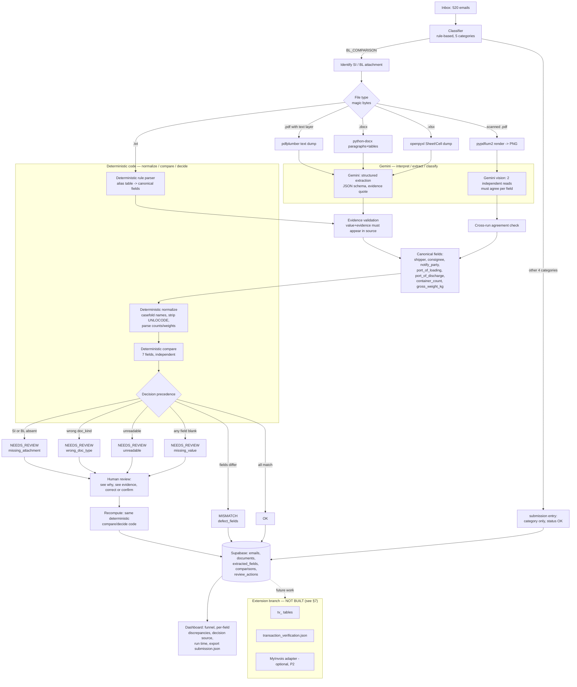

# SDOC — Shipping Document Verification

> AI interprets messy documents; deterministic software makes the verification decision; humans resolve genuine uncertainty.

This is not "an LLM that compares two documents." Gemini's only job is to read a document and hand back field values with evidence. Every `OK` / `MISMATCH` / `NEEDS_REVIEW` verdict and every `defect_fields` entry is produced by plain, auditable Python — the same code path every time, regardless of which model answered which extraction call.

## Table of contents

1. [Problem and operator workflow](#1-problem-and-operator-workflow)
2. [Why this approach](#2-why-this-approach)
3. [Architecture](#3-architecture)
4. [Quick start](#4-quick-start)
5. [Innovation](#5-innovation)
6. [Evaluation](#6-evaluation)
7. [Extension (not built — Future Work)](#7-extension-not-built--future-work)
8. [Data findings and Decisions log](#8-data-findings-and-decisions-log)
9. [Judging-evidence map](#9-judging-evidence-map)
10. [Demo script](#10-demo-script)

---

## 1. Problem and operator workflow

A shipping operations team's inbox mixes document-comparison requests with new shipping-instruction submissions, invoice questions, operational chatter, and spam. For a comparison request, a human has to:

1. Find the email and recognize it as a comparison request (not always obvious — some subjects are misleading, some genuine requests carry no attachment because it "was dropped").
2. Open the SI (Shipping Instruction, the reference) and the draft BL (Bill of Lading) attachments, in whatever format they arrive (plain text, PDF, Word, Excel, sometimes a scan).
3. Find the same seven shipment facts under whatever label each document happens to use — `Port of Loading` on one side, `Load Port` on the other, `POL` on a third.
4. Compare them and decide whether a difference is a real defect or just a formatting difference.
5. When something can't be determined (missing attachment, wrong document, unreadable scan, a blank value), flag it for a colleague instead of guessing.

Stakeholders: the documentation team preparing SI/BL pairs (this dataset's senders: aprilasia.com, april.com.my and counterpart trading/logistics partners), the reviewer who resolves `NEEDS_REVIEW` cases, and — indirectly — the customer or carrier who receives a wrong draft BL if a discrepancy is missed. Missed discrepancies mean corrections, delays, and rework after the fact; false alarms waste reviewer time. Both failure directions matter.

## 2. Why this approach

**What problem.** Turn an unsorted inbox into: which emails need document checking, what exactly differs between the two documents, and which cases are genuinely uncertain rather than wrong.

**Why technically hard.** Formats vary wildly (192 plain-text, 28 PDF, 22 Excel, 8 Word attachments in this dataset — see §8), labels for the same field vary within *and across* formats, some documents are scanned images, some emails' subjects are actively misleading, and roughly 76% of emails carry no attachment at all yet still have to be classified correctly from sender/subject/body alone.

**Why AI.** A fixed parser handles `.txt` well because its "Label: value" convention is consistent (see the alias table in §8). It cannot handle a PDF where "Shipper APRIL FINE PAPER TRADING" has no colon, sits next to a per-container weight table, and needs the *company name only* pulled out of a paragraph that also contains a mailing address. Gemini reads that reliably; a hand-written regex would not scale to the layout variety in the advanced dataset.

**Why not let AI decide.** Verification has to be deterministic, reproducible, and auditable — the same two documents must always produce the same verdict, and a judge (or a reviewer, or an auditor) has to be able to point at exactly which rule fired. An LLM call is not reproducible enough for that role, and it should not be: extraction is a reading task; comparison is a policy decision. Section 5 ("Compare") and Section 9 ("Ask for help") of the official brief describe exactly this split.

**What is different.** See [§5 Innovation](#5-innovation).

## 3. Architecture



The whole flow is readable top to bottom in well under 30 seconds: **Gemini only ever appears on the "interpret" side** (reading a document, or classifying an ambiguous email); **every arrow after normalization is plain Python** making the actual pass/fail call. Gemini never sees `has_defect` or writes `defect_fields`.

### Document reading, by format

| Input | Reader | Extraction |
|---|---|---|
| `.txt` (192 files) | plain text | Deterministic alias-table parser (`core/extract_rules.py`) — no LLM call at all |
| `.docx` (8), `.xlsx` (22) | `python-docx` / `openpyxl` → text dump | Gemini structured extraction + evidence validation |
| `.pdf` with a text layer (25 of 28) | `pdfplumber` | Gemini structured extraction + evidence validation |
| `.pdf` scanned/image-only (3 of 28) | `pypdfium2` → PNG | Gemini vision, **two independent reads**, a field is kept only if both agree |

File type is detected by magic bytes (`readers/filetype.py`), never by filename extension — a `.txt`-named file is never trusted as text without checking, and vice versa.

## 4. Quick start

```bash
python -m venv .venv && source .venv/Scripts/activate   # or .venv/bin/activate on Linux/Mac
pip install -r requirements-dev.txt   # requirements.txt + pytest/httpx/pip-audit; app image installs only requirements.txt
cp .env.example .env   # fill in SUPABASE_URL, SUPABASE_SERVICE_KEY, GEMINI_API_KEY, DASHBOARD_PASSWORD, SESSION_SECRET

# apply db/schema.sql to your Supabase project (SQL editor, or supabase CLI)

python scripts/run_pipeline.py --out submission.json          # local only
python scripts/run_pipeline.py --out submission.json --persist  # also writes to Supabase
python scripts/validate_submission.py submission.json
python scripts/evaluate.py            # dev-set metrics
pytest -q                             # 129 tests
pip-audit -r requirements.txt         # check for known CVEs in pinned floors

uvicorn app.main:app --reload         # dashboard at http://localhost:8000, password in .env
```

`requirements.txt` pins security floors (`pdfminer.six`, `python-multipart`) but otherwise uses `>=`, not exact versions — for a fully reproducible, hash-pinned install, generate a lockfile in an environment matching the Dockerfile's Python version (3.12): `pip install pip-tools && pip-compile --generate-hashes -o requirements.lock.txt requirements.txt`, then `pip install -r requirements.lock.txt`. Not generated here since this dev environment runs a different Python version and a lockfile pinned under the wrong version can reference wheel hashes that don't exist for the target runtime.

`core/` has no network or DB imports and is fully unit-testable on its own; `readers/` and `llm/` are the only modules that touch the network (Gemini), and `storage/` is the only module that touches Supabase. The pipeline writes a valid `submission.json` even if Supabase is completely unreachable — `--persist` is opt-in.

## 5. Innovation

- **Evidence-backed extraction.** Every Gemini-sourced field carries the verbatim source line/cell it came from (`evidence_quote`), and that evidence is machine-checked to actually appear in the source document before the field is trusted (`llm/validate.py`). A hallucinated value with no matching evidence is discarded, not silently kept.
- **AI + deterministic verification, strictly separated.** Gemini fills a fixed JSON schema (`llm/schemas.py`); `core/decide.py` never imports anything from `llm/`. The LLM cannot set `has_defect`, cannot skip a review reason, cannot invent an eighth field.
- **Semantic field alignment.** The canonical field names (`shipper`, `port_of_loading`, ...) are what force alignment across "Port of Loading" / "Load Port" / "POL" without ever comparing header text. Limitation: `_normalize_label()` strips non-ASCII characters before matching, so a label mixing English and Chinese (e.g. `gross weight毛重(kgs)`) still aligns on its English portion, but a label written purely in a non-Latin script currently extracts nothing rather than guessing — deliberately safe, but a real gap, not something the alias table already solves for arbitrary non-English labels.
- **Exact defect-set identification.** Each of the 7 fields is compared independently; `defect_fields` is the exact set that differs, in stable order — not "something differs somewhere."
- **Honest uncertainty as a first-class outcome.** `NEEDS_REVIEW` is not an error path bolted on afterward — it is one of five possible terminal states with equal standing, produced by the same precedence logic as `OK`/`MISMATCH` (`core/decide.py`). A blank field or a corrupt PDF is treated as *uncertainty*, never coerced into a guessed `OK`.
- **Evidence validation closes the loop, not just extraction.** A value is only trusted if its evidence quote equals the value after stripping the field's own label (rejecting a truncated value or a quote borrowed from a different field's line, `llm/validate.py`), and a human reviewer's correction — including overriding the `doc_kind`/`readable` signal that caused an escalation — re-enters the same deterministic `decide()` path rather than sitting outside it as a side channel.
- **Cross-document transaction verification** — scoped, designed, but not built in the 24-hour window available for this submission. See §7.

## 6. Evaluation

**Measured result** (full pipeline, `scripts/run_pipeline.py`, all 520 emails, real Gemini calls, Gemini responses cached by `sha256(bytes + prompt_version + model + kind + role)`):

| Metric | Value |
|---|---|
| Total emails processed | 520 |
| Comparison requests (`BL_COMPARISON`) | 129 |
| Auto-resolved within comparison requests (`OK` + `MISMATCH`) | 111 (63 `OK` + 48 `MISMATCH`) |
| `NEEDS_REVIEW` (within comparison requests) | 18 |
| `OK` (all 520, incl. 391 non-comparison emails whose category alone determines the submission entry) | 454 |
| `MISMATCH` | 48 |
| Review reasons | `wrong_doc_type` 5, `missing_attachment` 5, `unreadable` 2, `missing_value` 6 |
| Total runtime (cold, fresh Gemini calls) | 118.9s (≈228 ms/email) |
| Total runtime (warm cache, incl. Supabase writes) | 87.2s (≈168 ms/email) |
| `submission.json` shape | Valid — `scripts/validate_submission.py` passes against `sample_submission.json` |

**Dev-set metrics** (`tests/dev_labels.json`, 42 emails I hand-labeled by reading the actual email/attachment content — covers all 5 categories, all 4 review reasons, and all four attachment formats):

| Metric | Value |
|---|---|
| Classification macro-F1 | 1.000 |
| Defect-detection F1 (`has_defect`, n=10) | 1.000 |
| End-to-end exact `defect_fields` + status match (n=10) | 10/10 |
| Review-reason exact match (n=9) | 9/9 |

**Known limitation — dev-set circularity.** These dev-set numbers are optimistic and I am flagging that explicitly: I derived the classification rules and the extraction alias table *by reading these same emails*, then hand-labeled a subset of the ones I had already read as the dev set. A perfect score here mostly confirms the implementation matches my own understanding of the data, not that the system generalizes to unseen wording. It is a regression check, not an independent accuracy measurement. **Not measured yet:** true held-out accuracy, since no ground truth is available in this bundle (`data/README.md` confirms this explicitly) and the competition's private reference set is never in scope here.

**Per-field validation.** All 7 fields are exercised by both the pytest suite (`tests/test_extract_rules.py`, `tests/test_normalize.py`, `tests/test_decide.py`) and the dev set, so no aggregate metric can hide one broken field.

**Manual baseline:** Not measured yet — no timing data on human manual comparison exists for this dataset.

### Failure analysis (only failures actually observed)

| Metric | Result | What failed | Why | Safeguard | Remaining limitation |
|---|---|---|---|---|---|
| PDF/XLSX/DOCX field extraction | Fixed after observation | Gemini's `doc_kind` came back as free text (`"SHIPPING_INSTRUCTION"`) instead of the fixed enum | The schema field was a plain `str`, not constrained | Changed `doc_kind` to a `Literal[...]` in `llm/schemas.py` so the response schema itself rejects any other value | None known after the fix, but only checked on this dataset |
| PDF/XLSX/DOCX name fields | Fixed after observation | Gemini merged a party name with the *following* address/"ON BEHALF OF ..." line into one value (e.g. shipper became `"APRIL FINE PAPER TRADING \| ON BEHALF OF VITAL SOLUTIONS PTE LTD"` on one side of a pair but not the other) | Nothing in the schema told the model where a name ends and an address begins | Added an explicit prompt rule: extract only the single line/cell, never merge with an adjacent line/row/cell | A future document with an unusual layout could still trigger this; evidence validation would not catch it since the "hallucinated" text is real, just wrongly scoped |
| Scanned PDF (`email_513`) | **Observed, working as designed** | The two independent Gemini vision reads of the BL page disagreed on `port_of_loading` | OCR/vision reading of a scanned page is inherently less reliable than a text layer | The two-read agreement check (`llm/gemini_client.extract_from_images`) discarded the field rather than picking either answer; the comparator then correctly saw a blank field and returned `NEEDS_REVIEW / missing_value` instead of a guess | The email now needs a human to read the scan; this is intended behavior, not a bug, but it means scanned-document throughput is lower than text-document throughput |
| Corrupt PDFs (`email_511`, `email_515`) | **Observed, working as designed** | Both files are structurally invalid PDFs (`pdfminer`: "No /Root object") | Synthetic edge cases in the 501–520 range | `pdfplumber` raises, is caught, returns empty text; `pypdfium2` then also fails to render pages; the document is marked `readable=False` → `NEEDS_REVIEW / unreadable` | None — this is the intended path |
| Classification of "please send the BL" emails | Resolved by design decision (§8) | An early draft risked marking these `missing_attachment` | The brief explicitly warns against this; body text asks someone to *send* a document, not to *compare* one | Classifier requires an explicit compare/confirm phrase (`core/classify.py: COMPARISON_INTENT`) before treating a no-attachment email as `BL_COMPARISON` | Any comparison-intent phrasing not seen in this dataset's ~40-email sample would fall through to `GENERAL` untested |
| Gemini classification fallback | Not needed | N/A | Rule-based classification already reaches macro-F1 1.000 on the dev set because sender domain cleanly separates spam (6 domains, 40 emails) from the 9 legitimate business domains, and phrase-based rules cleanly separate the other 4 categories | `GEMINI_CLASSIFY_FALLBACK=true` is wired but never actually triggers for a "confident" rule match, so its ablation would show ~no effect here | An inbox with less clean-cut sender domains would need the fallback exercised for real; not measured in this dataset |

## 7. Extension (not built — Future Work)

The brief describes an optional Cross-Document Transaction Verification extension (shipping documents ↔ commercial invoice ↔ structured e-Invoice, pinned to the MyInvois Invoice v1.1 field layout). **This was not started.** At the start of this build I had approximately 24 hours until the deadline, and the brief's own scope guard (§3/§12 of the build brief) says explicitly: *"if too little [time], skip §12 and record it in README as Future work."* I used the full 24 hours to make the core (P0) genuinely solid — Gemini extraction across all four attachment formats including scanned PDFs, a working human-review-and-recompute loop verified against real data, and a deployed dashboard — rather than spreading the same hours across a second, separate feature.

If resumed, the design in the build brief is directly actionable: separate `tv_*` tables, a separate `transaction_verification.json` export, a feature flag (`ENABLE_TRANSACTION_VERIFICATION`, already present in `.env.example` and defaulted `false`), and four independent result axes (SI/BL result, cross-document result, local payload pre-check, MyInvois status) that never touch the core `defect_fields` enum. None of this is scaffolded beyond the config flag — stating that plainly rather than implying partial progress that doesn't exist.

## 8. Data findings and Decisions log

Every number below came from reading the actual bundle in `data/`, never from an answer key — none exists in this bundle (`data/README.md` states this explicitly), and I did not search for one anywhere else.

**Counts.** 520 emails; 126 carry attachments (394 do not); attachment formats: 192 `.txt`, 28 `.pdf`, 22 `.xlsx`, 8 `.docx`.

**Sender domains (all 520 emails, exhaustive).** Only 15 distinct domains appear. Nine are real trading/logistics counterparties named throughout the subjects (`aprilasia.com`, `april.com.my`, `algurg.ae`, `fujitogrp.com`, `ifpla.com`, `psabdp.com`, `roxcel.at`, `safqa.co.ke`, `vitalsolutions.sg`). The other six (`crypto-invest.net`, `logistics-deals.biz`, `parcel-track.co`, `prize-claims.info`, `secure-mailbox.org`, `webmail-verify.co`, 40 emails total) send nothing but prize/crypto/"verify your account" template text with no relationship to any shipment in the dataset. **Decision:** classify by this domain split first, keyword scoring second — this is far more reliable than keyword-only spam detection and was confirmed against the dev set's 7 SPAM examples (e.g. `email_015`, `email_072`, `email_123`, `email_226`).

**Label survey (`.txt` attachments, all 192 files).** Built the alias table in `core/extract_rules.py` by scanning every `Label: value` line across every `.txt` attachment (see examples: `Shipper` / `Shipper/Exporter` / `Shipper (Principal or Seller)`; `Port of Loading` / `Load Port` / `POL`; `Gross Weight (KG)` / `Gross Wt (kgs)` / `Gross Weight毛重(KGS)`). Explicitly excluded from the 7-field alias table: `NET WEIGHT` (a real, different field that must never be confused with `gross_weight_kg` — confirmed as a deliberate distractor in `email_516`), `Booking Ref`, `BL No.`, `Vessel`/`Voyage`, `HS Code`, `Description`/`Commodity`, and commercial-invoice/certificate-of-origin-only fields (`Invoice No.`, `Seller`, `Buyer`, `Certificate No.`, `Country of Origin`).

**"Please send the BL" emails (Phase 0 task, ≥25 read).** Two visibly different email templates share the surface feature "mentions a draft BL, no attachment":
- *"Please assist to send the draft BL for [ref] for checking asap."* — an internal handoff asking a colleague to produce/forward a document. Nothing to compare yet. **Decision: `GENERAL`.** Examples: `email_003`, `email_006`, `email_016`, `email_018`, `email_036`, `email_038`, `email_047`, `email_189`.
- *"Please compare the SI and draft BL for [ref] and confirm (attachments appear to have been dropped)."* / *"... (the draft BL is still missing)."* — an explicit comparison request where the documents are absent. **Decision: `BL_COMPARISON` / `NEEDS_REVIEW` / `missing_attachment`.** Examples: `email_506`, `email_507`, `email_508`, `email_510`.

The discriminator is the verb: *send* (operational request, nothing to check yet) vs. *compare/confirm* (an explicit ask to verify two documents that happen to be missing). This is encoded as `COMPARISON_INTENT` in `core/classify.py`.

**Known limitations of the classifier and role assignment, not fixed here.** These are honest gaps, not deliberate design decisions, called out for transparency rather than papered over:
- `core/classify.py`'s domain trust is based on the `From` header alone, with no SPF/DKIM verification — fine for this fixed, 15-domain synthetic dataset (confirmed exhaustively above), but spoofable in a real mail system.
- Known business domains are matched exactly; a subdomain (e.g. `mail.aprilasia.com`) would not be recognized as trusted even though the parent domain is.
- `SPAM_KEYWORDS` matches substrings with no word boundaries, so a legitimate word merely containing one of the phrases could false-positive.
- SI/BL role assignment (`core/pipeline._find_attachment`, matching `_SI.`/`_BL.` in the filename) is filename-pattern-based. This is different from — and does not contradict — the "never by filename" claims elsewhere in this doc, which are about *file-type* detection (magic bytes, §3) and *doc_kind* classification (content/banner, `core/extract_rules.detect_doc_kind`), both of which genuinely never look at the filename. Role assignment is a real exception: there is no reliable content-based signal for "which attachment is meant to be the SI" before any content has been read.

**Wrong-document-type detection is unusually explicit in this dataset.** Every synthetic "wrong document" `.txt` attachment carries both a distinct header (`PACKING LIST`, `COMMERCIAL INVOICE`, `CERTIFICATE OF ORIGIN`) and an explicit disclaimer banner (e.g. `*** THIS IS A COMMERCIAL INVOICE - NOT A SHIPPING INSTRUCTION ***`, `*** PACKING LIST ONLY - NO PORT OR VESSEL DETAILS ***`). `core/extract_rules.detect_doc_kind()` uses the header; the banner is treated as corroboration, not the sole signal, so the same logic still works on formats where no banner exists (PDF/DOCX/XLSX, judged by Gemini reading the document's actual content, never its filename).

**Numeric tolerance.** `data/README.md` (the authoritative task definition for this competition) states no numeric tolerance for the comparison. **Decision:** exact equality after parsing units/separators — `container_count` sums `N x TYPE` groups (e.g. `1 x 40'HC + 2 x 20'GP`) into an integer, `gross_weight_kg` parses `KG`/`KGS`/`MT`/`M/T`/`TON(S)`/`TONNE(S)`/`LB(S)` into an exact `Decimal` kilogram value, detecting English (`1,234.50`) vs European (`1.234,50`) separator conventions (`core/normalize.py`). Either field returns `None` — never a guess — when the string has more than one distinct number or an unrecognised/missing unit; `core/compare.py` and `core/decide.py` route that to `NEEDS_REVIEW`/`missing_value` rather than silently comparing `None == None` as a match. If a future version of `data/README.md` specifies a tolerance, only `normalize.py`'s comparison call site needs to change.

**Ports.** The name is the primary key (never a UNLOCODE alone), per the brief's warning that a defect can change the port name while the code stays identical — but a code present on *both* sides is also compared, since a code-only change (same name, different `(MYPKG)`-style UNLOCODE) is a real defect a name-only comparison would silently hide. A code present on only one side is not itself a mismatch, since it's supporting evidence rather than a required field. Also handles a leading `CODE - NAME` form, not just the trailing `NAME (CODE)` form. See `ports_match()` in `core/normalize.py`.

**Names.** Casefold + strip punctuation + collapse whitespace only. Nothing else is folded — no legal-suffix removal, no word-order changes — because the dataset's actual defects (e.g. `email_004`: consignee silently changed from `EAST BRIGHT FZ-LLC` to `UAB NOVAKOPA`) are real company substitutions, not formatting noise, and over-normalizing risks hiding exactly that kind of defect.

**Decisions log (chronological, condensed).**
1. Use magic-byte detection, never file extension, for reader dispatch (`readers/filetype.py`) — a mislabeled extension should never cause binary bytes to be decoded as text.
2. `unreadable` must be checked before `wrong_doc_type` in the decision precedence, even though the brief lists them the other way round, because a document we could not read at all (e.g. a format not yet supported, mid-implementation) cannot be positively identified as "the wrong kind" — that would be a false claim of certainty. `wrong_doc_type` only fires once a document was actually read and its content proves it is something else. (`core/decide.py`)
3. Gemini's `doc_kind` is constrained to a `Literal` in the schema after observing it drift to free text (see Failure analysis).
4. Gemini's name-field extraction is constrained to "one line/cell, never merge with an adjacent line" after observing address-line bleed produce a false mismatch risk (see Failure analysis).
5. Scanned PDFs require two independent Gemini vision reads to agree per field; `email_513` is a real, observed case of this safeguard discarding an unreliable read rather than guessing.
6. `GEMINI_CLASSIFY_FALLBACK` is wired but not exercised in this dataset — rule-based classification already reaches macro-F1 1.000 on the dev set (see §6).
7. The Cross-Document Transaction Verification extension (§12 of the build brief) was not started given the ~24-hour time budget; recorded as Future Work (§7) rather than left unmentioned.

## 9. Judging-evidence map

| Criterion | Evidence in the project | Remaining gap | Action taken |
|---|---|---|---|
| Working Core Prototype (25) | Full 520-email run produces a validated `submission.json`; real SI/BL comparison with exact `defect_fields`; all 4 `NEEDS_REVIEW` reasons exercised on real data; human correction on `email_004` verified live to flip `defect_fields` from `[consignee, notify_party]` to `[notify_party]` and re-persist | None for the scope attempted | — |
| System Design & Architecture (15) | Mermaid diagram (§3) with an explicit Gemini/deterministic split; Supabase schema (`db/schema.sql`, 8 tables, RLS on); dashboard reads/writes the same schema | Extension branch not implemented, only shown as a dotted future edge in the diagram | Labeled explicitly in the diagram and §7 |
| Technology Integration (15) | Gemini used only where fixed rules fail (PDF/DOCX/XLSX/scanned, not `.txt`); structured JSON schema with evidence quotes; evidence validated against source text before being trusted; two-pass agreement for vision | — | — |
| Technical Feasibility & Validation (15) | Dev-set metrics (§6), per-field tests, a documented failure-analysis table with real observed cases, 46 passing pytest tests, reproducible one-command pipeline | Dev-set metrics are self-labeled and circular (disclosed in §6), no independent held-out set exists | Disclosed explicitly rather than presented as clean accuracy |
| Problem Statement Understanding (10) | §1 written from the operator's workflow, named stakeholders, sourced from the actual official use-case brief | — | — |
| Innovation & Solution Approach (10) | Six differentiators listed in §5, each traceable to a specific file/function | Cross-document verification (a 7th differentiator in the original build brief) not built | Marked Future Work, not claimed |
| Practical Value & Potential (10) | Real funnel numbers (§6): 129 comparison requests, 111 auto-resolved, 18 escalated; runtime measured at both cold and warm cache | No manual-baseline timing to compare against | Marked "Not measured yet" rather than invented |

## 10. Demo script

Runnable against the live dashboard or `TestClient` locally.

1. **Problem (0:15)** — Show the raw inbox: a `BL_COMPARISON` request sitting between an `SI_REQUEST`, an `INVOICE_QUERY`, and spam from `webmail-verify.co`.
2. **Triage (0:10)** — Dashboard category counts: 129 comparison requests found among 520 mixed emails, 40 correctly identified as spam by domain.
3. **Understanding (0:20)** — Open `email_001`'s detail view: SI says `Port of Loading`, BL says `Port of Loading (POL)` — same canonical field, aligned automatically.
4. **Verification (0:15)** — Open `email_004`: `consignee` differs (`EAST BRIGHT FZ-LLC` vs `UAB NOVAKOPA`) → `MISMATCH`, `defect_fields: [consignee, notify_party]`.
5. **Evidence (0:10)** — Same page: each value's source line and extraction method (`rule` for this `.txt` pair) are shown side by side.
6. **Uncertainty (0:20)** — Open `email_507`: SI attached, BL genuinely missing → `NEEDS_REVIEW / missing_attachment`, explained as a deliberate refusal to guess, not a failure.
7. **Human review (0:25)** — Confirm `email_507` as reviewed; then on `email_004`, correct the BL's `consignee` field to `EAST BRIGHT FZ-LLC` and show the recompute live-narrow the defect set to just `[notify_party]`, with the audit trail entry appearing below.
8. **Impact (0:20)** — Dashboard summary: 520 processed, 129 comparison requests (111 auto-resolved, 18 escalated), full run in 119s — then state plainly that the transaction-verification extension is Future Work, not part of this number.

---

**Labeling key used throughout this document:** *Measured result* (from an actual run in this repo) · *Observed failure* (something that broke and was fixed, with evidence) · *Known limitation* (a real, disclosed gap) · *Future work* (designed but not built) · *Not measured yet* (no data exists to make the claim).
